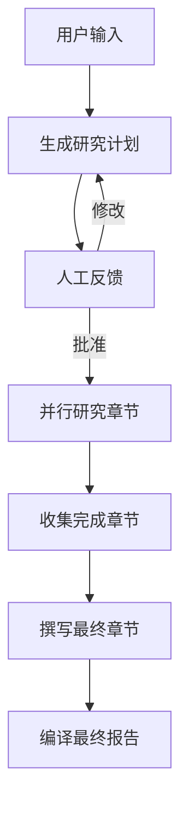

# 🔬 Deep Research Assistant

基于 LangGraph 和 Streamlit 的 AI 深度研究工具，专注于 Web3 和区块链分析。

## ✨ 功能特性

- 🤖 **智能研究**: 使用 LangGraph 工作流进行多步骤深度研究
- 💬 **交互界面**: 基于 Streamlit 的现代化聊天界面
- 📊 **实时进度**: 可视化研究进度和工作流状态
- 🔧 **灵活配置**: 可调整模型、搜索深度等参数
- 📚 **历史记录**: 保存和查看研究历史
- 📋 **详细报告**: 生成结构化的研究报告

## 🚀 快速开始

### 1. 环境准备

确保您的系统已安装：
- Python 3.11+
- uv 包管理器

### 2. 安装依赖

```bash
# 克隆或进入项目目录
cd web3_deep_research

# 同步依赖
uv sync
```

### 3. 启动应用

```bash
# 启动 Streamlit 应用
uv run streamlit run streamlit_app.py
```

应用将在浏览器中自动打开，默认地址：`http://localhost:8501`

## 🎯 使用指南

### 基础使用

1. **输入研究主题**: 在输入框中输入您想要研究的主题
2. **配置参数**: 在侧边栏调整研究参数和模型设置
3. **开始研究**: 点击"🚀 开始研究"按钮
4. **查看结果**: 等待研究完成，查看生成的报告

### 配置选项

#### 研究参数
- **最大章节数**: 控制报告的章节数量 (3-10)
- **搜索深度**: 控制研究的深度级别 (1-5)

#### 模型配置
- **写作模型**: 用于生成内容的模型
  - GPT-4 (推荐)
  - GPT-3.5-turbo
  - Claude-3-sonnet
  - Claude-3-haiku

- **规划模型**: 用于规划和反思的模型
  - GPT-4
  - Claude-3-sonnet (推荐)
  - Claude-3-haiku

### 界面功能

#### 主界面
- **💬 研究对话**: 主要的交互区域，显示研究过程和结果
- **📈 研究进度**: 实时显示研究进度条和状态

#### 侧边栏
- **⚙️ 配置选项**: 调整研究参数和模型设置
- **📊 当前状态**: 显示实时研究状态
- **📚 研究历史**: 查看最近的研究主题

## 🔧 技术架构

### 核心组件

1. **deep_research.py**: 主要的 LangGraph 工作流
   - 报告规划
   - 信息搜索
   - 内容生成
   - 人工反馈集成

2. **streamlit_app.py**: Streamlit 用户界面
   - 交互式聊天界面
   - 参数配置
   - 进度显示

3. **streamlit_runner.py**: 异步工作流集成
   - 处理 Streamlit 和异步代码的集成
   - 提供错误处理和超时机制

### 工作流程



## 📦 项目结构

```
web3_deep_research/
├── deep_research.py          # 主要的 LangGraph 工作流
├── streamlit_app.py          # Streamlit 用户界面
├── streamlit_runner.py       # 异步集成工具
├── pyproject.toml           # 项目依赖配置
├── README.md                # 项目文档
└── legacy/                  # 辅助模块
    ├── state.py            # 状态定义
    ├── prompts.py          # 提示模板
    ├── configuration.py    # 配置管理
    └── utils.py            # 工具函数
```

## 🔌 模式说明

### 完整模式
当所有依赖正确加载时，应用运行在完整模式：
- ✅ 真实的 LangGraph 工作流
- ✅ 实际的 AI 模型调用
- ✅ 外部信息搜索

### 模拟模式
当深度研究模块无法加载时，应用运行在模拟模式：
- ⚠️ 模拟的研究报告
- ⚠️ 演示用的界面功能
- ✅ 所有 UI 功能可用

## 🛠 开发

### 添加新依赖

```bash
# 添加生产依赖
uv add package-name

# 添加开发依赖
uv add --dev package-name
```

### 代码格式化

```bash
# 格式化代码
uv run black .

# 检查代码质量
uv run ruff check .
```

### 测试运行

```bash
# 测试异步集成
uv run python streamlit_runner.py

# 测试主工作流
uv run python deep_research.py
```

## 📝 示例用法

### 研究主题示例

- "Web3 的发展趋势和挑战"
- "区块链技术在金融行业的应用"
- "去中心化自治组织(DAO)的治理模式"
- "NFT 市场的现状和未来发展"
- "央行数字货币(CBDC)的全球发展状况"

### 期望输出

应用将生成包含以下部分的结构化报告：
- 📋 执行摘要
- 🔍 核心发现
- 📊 详细分析
- 🎯 结论与建议

## 🤝 贡献

欢迎提交 Issue 和 Pull Request 来改进这个项目。

## 📄 许可证

本项目使用 MIT 许可证。

---

🔬 **Deep Research Assistant** | Powered by LangGraph & Streamlit
